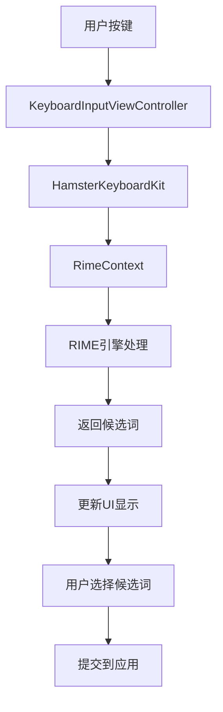
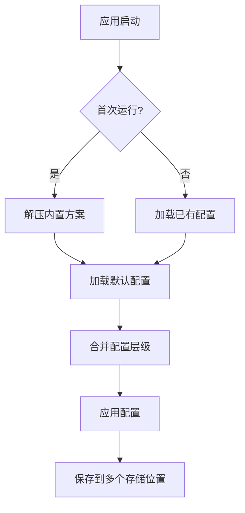
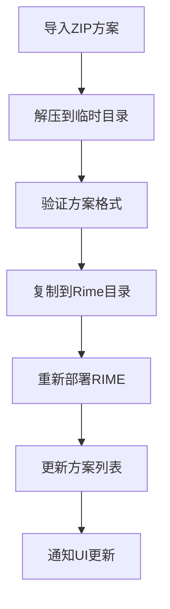
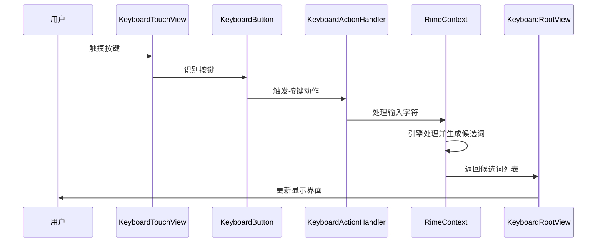

# Hamster iOS输入法剖析

## 项目概述

「仓」输入法（Hamster）是基于 RIME（中州韻輸入法引擎）开发的 iOS 端输入法应用。它采用了 iOS 的键盘扩展（Keyboard Extension）技术，将 RIME 引擎移植到 iOS 平台。

### 核心架构理念

1. **输入法引擎（RIME Engine）**：负责输入法的核心算法和数据处理
2. **数据驱动（输入方案）**：通过不同的输入方案数据文件驱动引擎产生不同的输入行为
3. **交互界面（iOS UI）**：提供用户与引擎交互的 iOS 原生界面

## 目录结构详细分析

### 根目录文件

#### 1. `README.md`
项目说明文档，包含：
- 项目介绍：基于 RIME 引擎的 iOS 输入法
- 编译说明：使用 `make framework` 下载预编译的 Framework
- 依赖管理：避免了本地编译 librime 的复杂性
- 第三方库清单：详细列出了所有依赖的开源项目

#### 2. `Makefile`
构建脚本，主要功能：
- `make framework`：下载预编译的 librime Framework
- `make schema`：下载内置输入方案
- 简化了项目的构建流程

#### 3. `LICENSE.txt`
许可证文件，项目从 v2.1.0 开始从 GPL-3.0 变更为 MIT 许可

#### 4. `InputSchemaBuild.sh`
输入方案构建脚本，用于：
- 处理输入方案的编译和打包
- 将输入方案集成到应用中

#### 5. `librimeFramework.sh`
librime Framework 下载脚本，用于：
- 从 GitHub Release 下载预编译的 librime Framework
- 避免本地编译的复杂性

### 主应用目录：`Hamster/`

这是主应用的代码目录，包含应用的入口和基础配置。

#### `AppDeletet.swift`
```swift
@main
class AppDelegate: UIResponder, UIApplicationDelegate {
    func application(_ application: UIApplication, didFinishLaunchingWithOptions launchOptions: [UIApplication.LaunchOptionsKey: Any]?) -> Bool {
        return true
    }
    // ... 其他生命周期方法
}
```

**作用分析**：
- `@main` 标记：这是应用的入口点（类似 Java 的 main 方法）
- `UIApplicationDelegate`：应用程序委托协议，处理应用级别的事件
- `didFinishLaunchingWithOptions`：应用启动完成后的回调方法
- 采用了现代的 Scene-based 架构，将大部分逻辑委托给 SceneDelegate

#### `SceneDelegate.swift`
```swift
class SceneDelegate: UIResponder, UIWindowSceneDelegate, UISceneDelegate {
    var window: UIWindow?
    
    func scene(_ scene: UIScene, willConnectTo session: UISceneSession, options connectionOptions: UIScene.ConnectionOptions) {
        guard let windowScene = (scene as? UIWindowScene) else { return }
        
        if window == nil {
            let window = UIWindow(windowScene: windowScene)
            window.rootViewController = HamsterAppDependencyContainer.shared.makeRootController()
            self.window = window
            window.makeKeyAndVisible()
        }
        // ... URL处理和快捷方式处理逻辑
    }
}
```

**关键功能分析**：

1. **依赖注入容器**：
   ```swift
   window.rootViewController = HamsterAppDependencyContainer.shared.makeRootController()
   ```
   - 使用单例模式的依赖注入容器
   - 负责创建和管理应用的根控制器

2. **URL 处理机制**：
   ```swift
   if let url = connectionOptions.urlContexts.first?.url {
       if url.pathExtension.lowercased() == "zip" {
           // 处理 ZIP 文件导入
           HamsterAppDependencyContainer.shared.inputSchemaViewModel.importZipFile(fileURL: url)
       }
   }
   ```
   - 支持外部 ZIP 文件导入（输入方案）
   - 支持通过 URL Scheme 打开特定功能页面

3. **快捷方式支持**：
   ```swift
   if let shortItem = connectionOptions.shortcutItem {
       // 处理 iOS 快捷方式（3D Touch/长按图标）
   }
   ```

#### 应用配置文件

1. **`Info.plist`**：应用信息配置文件
   - Bundle ID：`com.xlab.aiime`
   - 支持的 URL Schemes
   - 权限声明

2. **`Hamster.entitlements`** 和 **`HamsterDebug.entitlements`**：
   - App Groups：`group.com.xlab.aiime`（用于主应用和键盘扩展共享数据）
   - iCloud 容器权限
   - 其他系统权限声明

### 键盘扩展目录：`HamsterKeyboard/`

这是真正的输入法实现部分，作为 iOS 键盘扩展运行。

#### `HamsterKeyboardInputViewController.swift`
```swift
import HamsterKeyboardKit
import UIKit

public class HamsterKeyboardInputViewController: KeyboardInputViewController {}
```

**分析说明**：
- 继承自 `KeyboardInputViewController`（来自 HamsterKeyboardKit）
- 空实现，所有逻辑都在父类中
- 这是 iOS 键盘扩展的标准架构模式

**iOS 键盘扩展机制**：
- 键盘扩展运行在独立的进程中
- 受到严格的内存和权限限制
- 通过 App Groups 与主应用共享数据

#### 本地化文件：`*.lproj/InfoPlist.strings`
支持多语言显示名称：
- `zh-Hans`：简体中文
- `zh-Hant`：繁体中文
- `zh-HK`：香港繁体
- `en`：英文

### Swift Package Manager 包目录：`Packages/`

项目采用模块化架构，将功能拆分成多个 Swift Package。

#### `HamsterKit/`
**核心工具包**，包含：
- 常量定义：`HamsterConstants.swift`
- 文件管理工具
- 基础数据结构
- 工具类和扩展

**关键常量分析**：
```swift
public enum HamsterConstants {
    public static let appGroupName = "group.com.xlab.aiime"
    public static let keyboardBundleID = "com.xlab.aiime.HamsterKeyboard"
    public static let rimeUserPathName = "Rime"
    public static let inputSchemaZipFile = "SharedSupport.zip"
}
```

#### `HamsterKeyboardKit/`
**键盘 UI 框架**，包含：

1. **配置管理系统**：
   ```swift
   public struct HamsterConfiguration: Codable {
       public var general: GeneralConfiguration?
       public var toolbar: KeyboardToolbarConfiguration?
       public var keyboard: KeyboardConfiguration?
       public var rime: RimeConfiguration?
   }
   ```

2. **配置仓储模式**：
   ```swift
   public class HamsterConfigurationRepositories {
       public static let shared = HamsterConfigurationRepositories()
       
       // 从 YAML 文件加载配置
       public func loadFromYAML(_ path: URL) throws -> HamsterConfiguration
       
       // 从 UserDefaults 加载配置
       public func loadFromUserDefaults() throws -> HamsterConfiguration
   }
   ```

3. **图像资源管理**：
   ```swift
   public class HamsterUIImage: KeyboardImageReader {
       public lazy var keyboardEmoji: UIImage = .asset("keyboardEmoji")!
       public lazy var keyboardBackspace: UIImage = .init(systemName: "delete.left")!
   }
   ```

#### `HamsteriOS/`
**iOS 平台特定代码**，包含：

1. **依赖注入容器**：
   ```swift
   open class HamsterAppDependencyContainer {
       public static let shared = HamsterAppDependencyContainer()
       
       public let rimeContext: RimeContext
       public let mainViewModel: MainViewModel
       
       public lazy var settingsViewModel: SettingsViewModel = { /* ... */ }()
       public lazy var inputSchemaViewModel: InputSchemaViewModel = { /* ... */ }()
   }
   ```

2. **ViewModel 层**：
   - `MainViewModel`：主界面逻辑
   - `SettingsViewModel`：设置界面逻辑
   - `InputSchemaViewModel`：输入方案管理
   - `RimeViewModel`：RIME 引擎交互

#### `RimeKit/`
**RIME 引擎封装包**，包含：
- RIME 引擎的 Swift 封装
- C++ 与 Swift 的桥接代码
- 引擎初始化和配置管理

#### `HamsterUIKit/`
**UI 组件库**，包含：
- 自定义 UI 组件
- 主题和样式管理
- 布局工具

#### `HamsterFileServer/`
**文件服务器包**，包含：
- HTTP 服务器实现
- 文件上传下载功能
- Web 管理界面

### 资源目录：`Resources/`

#### `SharedSupport/hamster.yaml`
**默认配置文件**，定义了：
- 输入法的默认设置
- 键盘布局配置
- RIME 引擎参数

#### 本地化字符串：`*.lproj/InfoPlist.strings`
多语言支持的应用显示名称配置。

### 构建配置：`Hamster.xcodeproj/`

#### `project.pbxproj`
Xcode 项目配置文件，包含：
- Target 配置（主应用 + 键盘扩展）
- 依赖关系
- 编译设置
- Framework 链接配置

**关键 Target**：
1. **Hamster**：主应用 Target
2. **HamsterKeyboard**：键盘扩展 Target
3. **SbxlmKeyboard**：额外的键盘扩展（可能用于特定功能）

### CI/CD 配置

#### `.github/workflows/ci.yml`
GitHub Actions 配置，用于：
- 自动化构建
- 运行测试
- 代码质量检查

#### `ci_scripts/ci_post_clone.sh`
Xcode Cloud 构建脚本，在代码克隆后执行：
- 下载依赖的 Framework
- 设置构建环境

## 技术架构深度分析

### 1. 模块化架构设计

项目采用了高度模块化的设计，将功能拆分成多个独立的 Swift Package：

```
Hamster 主应用
    ↓ 依赖
HamsteriOS (iOS平台层)
    ↓ 依赖
HamsterKeyboardKit (键盘框架层)
    ↓ 依赖
HamsterKit (核心工具层)
    ↓ 依赖
RimeKit (RIME引擎封装层)
```

**优势**：
- **职责分离**：每个包负责特定功能
- **可测试性**：独立包便于单元测试
- **可复用性**：核心包可在其他项目中复用
- **维护性**：模块间依赖关系清晰

### 2. 依赖注入模式

项目使用单例模式实现依赖注入容器：

```swift
public class HamsterAppDependencyContainer {
    public static let shared = HamsterAppDependencyContainer()
    
    // 长生命周期对象
    public let rimeContext: RimeContext
    public let mainViewModel: MainViewModel
    
    // 懒加载对象
    public lazy var settingsViewModel: SettingsViewModel = {
        SettingsViewModel(
            mainViewModel: mainViewModel,
            rimeViewModel: rimeViewModel
        )
    }()
}
```

**设计优势**：
- **生命周期管理**：统一管理对象的创建和销毁
- **依赖解耦**：避免硬编码依赖关系
- **测试友好**：便于注入 Mock 对象

### 3. MVVM 架构模式

项目采用 MVVM（Model-View-ViewModel）架构：

- **Model**：配置数据模型（HamsterConfiguration 等）
- **View**：SwiftUI/UIKit 界面
- **ViewModel**：业务逻辑层（各种 ViewModel 类）

### 4. 配置管理系统

多层级配置系统，优先级从高到低：

1. **UI 操作配置**（UserDefaults）
2. **用户自定义配置**（`hamster.custom.yaml`）
3. **用户配置**（`hamster.yaml`）
4. **默认配置**（内置）

```swift
public func loadFromUserDefaults() throws -> HamsterConfiguration {
    var configuration = try loadConfiguration()
    
    // 读取用户配置文件
    if FileManager.default.fileExists(atPath: FileManager.hamsterConfigFileOnUserData.path) {
        let hamsterConfiguration = try loadFromYAML(FileManager.hamsterConfigFileOnUserData)
        configuration = try configuration.merge(with: hamsterConfiguration)
    }
    
    // 读取 UI 操作配置
    if let appConfig = try? loadAppConfigurationFromUserDefaults() {
        configuration = try configuration.merge(with: appConfig)
    }
    
    return configuration
}
```

## 关键类和对象详细分析

### HamsterAppDependencyContainer（依赖注入容器）

**职责**：应用级依赖注入容器，管理所有核心对象的生命周期

**关键属性**：
```swift
public class HamsterAppDependencyContainer {
    public static let shared = HamsterAppDependencyContainer()
    
    // 核心组件 - 立即初始化
    public let rimeContext: RimeContext          // RIME 引擎上下文
    public let mainViewModel: MainViewModel      // 主界面逻辑控制器
    
    // 功能模块 - 懒加载
    public lazy var settingsViewModel: SettingsViewModel = { /* ... */ }()
    public lazy var rimeViewModel: RimeViewModel = { /* ... */ }()
    public lazy var inputSchemaViewModel: InputSchemaViewModel = { /* ... */ }()
    
    // 配置管理
    public var configuration: HamsterConfiguration      // 当前配置
    public var applicationConfiguration: HamsterConfiguration  // 应用内设置的配置
}
```

**配置优先级机制**：
配置加载遵循以下优先级（从高到低）：
1. **应用UI操作配置**（存储在 UserDefaults）
2. **用户自定义配置**（`Rime/hamster.custom.yaml`）
3. **用户配置**（`Rime/hamster.yaml`）
4. **默认配置**（`SharedSupport/hamster.yaml`）

**初始化流程**：
```swift
private init() {
    self.rimeContext = RimeContext()
    self.mainViewModel = MainViewModel()
    
    if UserDefaults.standard.isFirstRunning {
        // 首次运行：解压内置方案，设置默认配置
        try FileManager.initSandboxSharedSupportDirectory(override: true)
        let hamsterConfiguration = try HamsterConfigurationRepositories.shared.loadFromYAML(FileManager.hamsterConfigFileOnSandboxSharedSupport)
        try HamsterConfigurationRepositories.shared.saveToUserDefaultsOnDefault(hamsterConfiguration)
        self.configuration = hamsterConfiguration
    } else {
        // 非首次：从 UserDefaults 加载配置
        self.configuration = try HamsterConfigurationRepositories.shared.loadFromUserDefaults()
    }
}
```

### RimeContext（RIME 引擎上下文）

**职责**：封装 RIME 引擎的 C++ 接口，提供 Swift 调用接口

**核心功能**：
- 引擎初始化和销毁
- 输入处理和候选词获取
- 方案切换和配置管理
- 词典部署和同步

### HamsterConfiguration（配置数据模型）

**结构**：
```swift
public struct HamsterConfiguration: Codable {
    public var general: GeneralConfiguration?              // 通用设置
    public var toolbar: KeyboardToolbarConfiguration?      // 工具栏配置
    public var keyboard: KeyboardConfiguration?            // 键盘布局配置
    public var rime: RimeConfiguration?                   // RIME 引擎配置
    public var swipe: KeyboardSwipeConfiguration?         // 滑动手势配置
    public var keyboards: [Keyboard]?                     // 自定义键盘
}
```

### HamsterConfigurationRepositories（配置仓储）

**职责**：配置的持久化和加载管理

**核心方法**：
```swift
public class HamsterConfigurationRepositories {
    // YAML 文件操作
    public func loadFromYAML(_ path: URL) throws -> HamsterConfiguration
    public func saveToYAML(config: HamsterConfiguration, path: URL) throws
    
    // UserDefaults 操作
    public func loadFromUserDefaults() throws -> HamsterConfiguration
    public func saveToUserDefaults(_ config: HamsterConfiguration) throws
    
    // 配置合并
    public func loadConfiguration() throws -> HamsterConfiguration
}
```

**配置合并逻辑**：
```swift
public func loadFromUserDefaults() throws -> HamsterConfiguration {
    var configuration = try loadConfiguration()
    
    // 1. 读取 Rime/hamster.yaml（如果存在）
    if FileManager.default.fileExists(atPath: FileManager.hamsterConfigFileOnUserData.path) {
        let hamsterConfiguration = try loadFromYAML(FileManager.hamsterConfigFileOnUserData)
        configuration = try configuration.merge(with: hamsterConfiguration)
    }
    
    // 2. 读取 Rime/hamster.custom.yaml（如果存在）
    if FileManager.default.fileExists(atPath: FileManager.hamsterPatchConfigFileOnUserData.path) {
        let patchConfiguration = try loadPatchFromYAML(yamlPath: FileManager.hamsterPatchConfigFileOnUserData)
        if let patch = patchConfiguration.patch {
            configuration = try configuration.merge(with: patch)
        }
    }
    
    // 3. 读取 UI 操作产生的配置（UserDefaults）
    if let appConfig = try? loadAppConfigurationFromUserDefaults() {
        configuration = try configuration.merge(with: appConfig)
    }
    
    return configuration
}
```

## iOS 键盘扩展机制分析

### 键盘扩展架构

iOS 键盘扩展运行在独立的进程中，与主应用分离：

```
主应用进程 (Hamster)
    ├── 设置界面
    ├── 方案管理
    └── 配置管理
    
键盘扩展进程 (HamsterKeyboard)
    ├── 键盘UI渲染
    ├── 输入处理
    └── RIME引擎调用
    
共享数据 (App Groups)
    ├── 配置文件
    ├── 输入方案
    └── 用户词典
```

### 数据共享机制

**App Groups**：
- ID：`group.com.xlab.aiime`
- 用途：主应用和键盘扩展共享数据
- 共享内容：配置文件、输入方案、用户数据

**文件路径管理**：
```swift
// HamsterConstants.swift
public enum HamsterConstants {
    public static let appGroupName = "group.com.xlab.aiime"
    public static let rimeUserPathName = "Rime"
    public static let rimeSharedSupportPathName = "SharedSupport"
}
```

### 键盘生命周期

```swift
public class HamsterKeyboardInputViewController: KeyboardInputViewController {
    // 继承自 KeyboardInputViewController（HamsterKeyboardKit）
    // 实现键盘的完整生命周期管理
}
```

## 数据流和业务逻辑分析

### 输入处理流程



### 配置管理流程



### 输入方案管理流程



## 核心技术点深入分析

### 1. Swift Package Manager 模块化设计

**依赖关系图**：
```
HamsteriOS
├── HamsterKeyboardKit
│   ├── HamsterKit
│   └── HamsterUIKit
├── RimeKit
│   └── librime (C++)
└── HamsterFileServer
    └── GCDWebServer
```

**模块职责**：
- **HamsterKit**：核心工具、常量、扩展
- **HamsterKeyboardKit**：键盘框架、配置管理
- **HamsterUIKit**：UI组件库
- **RimeKit**：RIME引擎Swift封装
- **HamsteriOS**：iOS平台特定代码
- **HamsterFileServer**：Web文件管理

### 2. MVVM 架构实现

**ViewModel 层次结构**：
```swift
MainViewModel                    // 主导航控制
├── SettingsViewModel           // 设置页面
├── RimeViewModel              // RIME引擎管理
├── InputSchemaViewModel       // 输入方案管理
├── BackupViewModel           // 备份恢复
└── KeyboardSettingsViewModel // 键盘设置
```

**数据绑定机制**：
- 使用 `@Published` 属性包装器
- Combine 框架实现响应式更新
- 观察者模式处理配置变更

### 3. 配置系统设计模式

**Strategy Pattern（策略模式）**：
不同的配置加载策略：
- YAMLConfigurationLoader
- UserDefaultsConfigurationLoader
- PropertyListConfigurationLoader

**Chain of Responsibility（责任链模式）**：
配置优先级链：
```swift
AppConfig -> CustomConfig -> UserConfig -> DefaultConfig
```

**Observer Pattern（观察者模式）**：
配置变更通知：
```swift
configuration.didSet {
    // 自动保存到多个存储位置
    // 通知相关组件更新
}
```

## 文件系统和存储分析

### 目录结构

```
App Groups Container/
├── Library/
│   └── Caches/
├── Documents/
│   ├── SharedSupport/          # 内置方案和配置
│   │   ├── hamster.yaml
│   │   └── 输入方案文件/
│   ├── Rime/                   # 用户数据目录
│   │   ├── hamster.yaml        # 用户配置
│   │   ├── hamster.custom.yaml # 用户自定义配置
│   │   ├── build/              # 编译后的配置
│   │   └── 词典文件/
│   └── backup/                 # 备份目录
└── tmp/                        # 临时文件
```

### 存储策略

1. **配置存储**：
   - UserDefaults：应用设置和缓存
   - YAML 文件：RIME 配置
   - Property List：键盘扩展配置

2. **方案存储**：
   - ZIP 包：方案分发格式
   - 文件夹：解压后的方案文件

3. **数据同步**：
   - iCloud 同步：可选的云端备份
   - 本地备份：ZIP 格式的完整备份

## 性能优化和内存管理

### 1. 懒加载模式

```swift
public lazy var settingsViewModel: SettingsViewModel = {
    // 只有在实际使用时才创建
    SettingsViewModel(/* 依赖注入 */)
}()
```

### 2. 单例模式

```swift
public class HamsterAppDependencyContainer {
    public static let shared = HamsterAppDependencyContainer()
    private init() { /* 确保单例 */ }
}
```

### 3. 内存约束处理

键盘扩展有严格的内存限制：
- 预加载关键资源
- 及时释放临时对象
- 使用弱引用避免循环引用

## 国际化和本地化

### 支持的语言

- `zh-Hans`：简体中文
- `zh-Hant`：繁体中文  
- `zh-HK`：香港繁体
- `zh`：中文通用
- `en`：英语

### 本地化文件结构

```
Resources/
├── zh-Hans.lproj/
│   └── InfoPlist.strings
├── zh-Hant.lproj/
│   └── InfoPlist.strings
└── en.lproj/
    └── InfoPlist.strings
```

## 构建和部署

### Xcode 项目配置

**主要 Target**：
1. **Hamster**：主应用
   - Bundle ID：`com.xlab.aiime`
   - 部署目标：iOS 15.0+

2. **HamsterKeyboard**：键盘扩展
   - Bundle ID：`com.xlab.aiime.HamsterKeyboard`
   - App Groups：启用
   - 键盘扩展权限：启用

### 依赖管理

**Swift Package Manager**：
- 外部依赖：ProgressHUD、Runestone 等
- 本地包：Packages/ 目录下的模块

**Framework 依赖**：
- librime：通过 `make framework` 下载
- Boost 库：C++ 依赖库

### CI/CD 流程

**GitHub Actions**（`.github/workflows/ci.yml`）：
- 自动化构建
- 单元测试
- 代码质量检查

**Xcode Cloud**（`ci_scripts/ci_post_clone.sh`）：
- 依赖下载
- 环境配置

## 总结

Hamster iOS 输入法是一个设计精良的 iOS 应用，具有以下特点：

1. **模块化架构**：使用 Swift Package Manager 实现高度模块化
2. **依赖注入**：通过容器模式管理复杂的依赖关系
3. **配置管理**：多层级配置系统，支持灵活的个性化设置
4. **RIME 集成**：成功将 C++ 的 RIME 引擎集成到 iOS 平台
5. **数据共享**：通过 App Groups 实现主应用和键盘扩展

## 详细包结构和文件分析

### `Packages/HamsterKeyboardKit/` - 键盘框架核心包

这是整个输入法的核心框架包，包含了键盘UI、输入处理、配置管理等核心功能。

#### 核心控制器：`KeyboardInputViewController`

**文件位置**：`Sources/Controller/KeyboardInputViewController.swift`

**继承关系**：
```swift
UIInputViewController -> KeyboardInputViewController -> HamsterKeyboardInputViewController
```

**职责**：
- iOS 键盘扩展的核心控制器
- 管理键盘的完整生命周期
- 处理输入事件和用户交互
- 与 RIME 引擎交互

**关键生命周期方法**：

```swift
open class KeyboardInputViewController: UIInputViewController, KeyboardController {
    override open func viewDidLoad() {
        super.viewDidLoad()
        setupCombineRIMEInput()  // 设置RIME输入响应
    }
    
    override open func viewWillAppear(_ animated: Bool) {
        super.viewWillAppear(animated)
        setupRIME()              // 初始化RIME引擎
        viewWillSetupKeyboard()  // 设置键盘UI
        viewWillSyncWithContext() // 同步键盘上下文
        
        // 修复屏幕边缘按键触摸延迟问题
        view.window?.gestureRecognizers?.forEach {
            $0.delaysTouchesBegan = false
        }
    }
    
    open func viewWillSetupKeyboard() {
        // 创建键盘根视图
        let keyboardRootView = KeyboardRootView(
            keyboardLayoutProvider: keyboardLayoutProvider,
            appearance: keyboardAppearance,
            actionHandler: keyboardActionHandler,
            keyboardContext: keyboardContext,
            calloutContext: calloutContext,
            rimeContext: rimeContext
        )
        // 设置约束和布局
    }
}
```

#### 键盘根视图：`KeyboardRootView`

**文件位置**：`Sources/View/KeyboardRootView.swift`

**职责**：
- 键盘的主容器视图
- 管理不同类型键盘的切换（拼音、英文、符号、表情等）
- 包含工具栏和主键盘区域

**组件结构**：
```swift
class KeyboardRootView: NibLessView {
    // 工具栏视图
    private lazy var toolbarView: UIView = {
        KeyboardToolbarView(
            appearance: appearance,
            actionHandler: actionHandler,
            keyboardContext: keyboardContext,
            rimeContext: rimeContext
        )
    }()
    
    // 主键盘视图（根据键盘类型动态选择）
    private lazy var primaryKeyboardView: UIView = {
        if let view = chooseKeyboard(keyboardType: keyboardContext.keyboardType) {
            return view
        }
        return standerSystemKeyboard
    }()
    
    // 标准系统键盘
    private lazy var standerSystemKeyboard: StanderSystemKeyboard = {
        StanderSystemKeyboard(/* 参数 */)
    }()
}
```

**键盘类型选择逻辑**：
```swift
private func chooseKeyboard(keyboardType: KeyboardType) -> UIView? {
    switch keyboardType {
    case .alphabetic: return alphabeticKeyboard
    case .numeric: return numericKeyboard
    case .symbolic: return symbolicKeyboard
    case .emojis: return emojisKeyboard
    default: return standerSystemKeyboard
    }
}
```

#### 标准系统键盘：`StanderSystemKeyboard`

**文件位置**：`Sources/View/StandarKeyboard/StanderSystemKeyboard.swift`

**职责**：
- 渲染标准的字母数字键盘
- 处理按键布局和样式
- 管理按键的触摸事件

**核心属性**：
```swift
public class StanderSystemKeyboard: KeyboardTouchView {
    private let keyboardLayoutProvider: KeyboardLayoutProvider  // 键盘布局提供者
    private let actionHandler: KeyboardActionHandler            // 按键动作处理器
    private let appearance: KeyboardAppearance                  // 键盘外观
    private var keyboardContext: KeyboardContext               // 键盘上下文
    private var rimeContext: RimeContext                       // RIME引擎上下文
    
    // 缓存所有按键视图
    private var keyboardRows: [[KeyboardButton]] = []
    // 约束管理
    private var staticConstraints: [NSLayoutConstraint] = []
    private var dynamicConstraints: [NSLayoutConstraint] = []
}
```

#### 触摸处理：`KeyboardTouchView`

**文件位置**：`Sources/View/KeyboardTouchView.swift`

**职责**：
- 统一处理键盘的多点触控
- 管理按键的按下、拖动、释放事件
- 支持同时多个按键的触摸

**触摸事件处理**：
```swift
public class KeyboardTouchView: NibLessView {
    enum ButtonEvent {
        case press, drag, release, cancel
    }
    
    // UITouch 与按键的映射关系
    private var touchOnButton: [UITouch: UIView] = [:]
    
    // 重写hitTest来拦截触摸事件
    override public func hitTest(_ point: CGPoint, with event: UIEvent?) -> UIView? {
        if let view = findNearestView(point) {
            if let button = view as? KeyboardButton {
                if button.item.action == .nextKeyboard {
                    return button  // 系统键盘切换按钮特殊处理
                }
                return self  // 其他按键由此视图统一处理
            }
        }
        return super.hitTest(point, with: event)
    }
}
```

#### 按键视图：`KeyboardButton`

**职责**：
- 单个按键的视图实现
- 处理按键的外观和状态
- 支持不同类型的按键内容（文字、图标、空格键等）

**按键内容视图**：`KeyboardButtonContentView`
```swift
public class KeyboardButtonContentView: NibLessView {
    // 根据按键类型选择不同的内容视图
    private lazy var spaceContentView: SpaceContentView = { /* 空格键视图 */ }()
    private lazy var imageContentView: ImageContentView = { /* 图标按键视图 */ }()
    private lazy var textContentView: TextContentView = { /* 文字按键视图 */ }()
}
```

### `Packages/HamsterKit/` - 核心工具包

#### 常量定义：`HamsterConstants`

**文件位置**：`Sources/Constants/HamsterConstants.swift`

```swift
public enum HamsterConstants {
    // App Groups ID - 用于主应用和键盘扩展共享数据
    public static let appGroupName = "group.com.xlab.aiime"
    
    // 键盘扩展 Bundle ID
    public static let keyboardBundleID = "com.xlab.aiime.HamsterKeyboard"
    
    // RIME 目录结构（与macOS版Squirrel保持一致）
    public static let rimeSharedSupportPathName = "SharedSupport"  // 预构建数据目录
    public static let rimeUserPathName = "Rime"                    // 用户数据目录
    
    // 应用URL Scheme
    public static let appURL = "hamster://com.xlab.aiime"
    
    // 系统设置路径
    public static let addKeyboardPath = "app-settings:root=General&path=Keyboard/KEYBOARDS"
}
```

#### 文件管理扩展

提供了大量的文件路径管理扩展，用于处理：
- App Groups 共享目录
- RIME 用户数据目录
- 配置文件路径
- 备份目录管理

### `Packages/RimeKit/` - RIME 引擎封装

#### `RimeContext` - RIME 引擎上下文

**职责**：
- 封装 librime C++ 接口
- 提供 Swift 友好的 API
- 管理输入会话状态
- 处理候选词和输入提交

**核心方法**：
```swift
public class RimeContext {
    // 引擎初始化
    public func setupRime() throws
    
    // 输入处理
    public func processKey(rimeKeyCode: Int32, mask: Int32) -> Bool
    
    // 获取输入状态
    public func getContext() -> RimeContext.Context?
    
    // 获取候选词
    public func getCandidates() -> RimeContext.Candidates?
    
    // 提交输入
    public func commitComposition() -> String?
    
    // 方案管理
    public func getSchemaList() -> [RimeSchema]
    public func selectSchema(schemaId: String) -> Bool
}
```

### 数据流和交互机制详细分析

#### 用户输入处理流程



#### 配置加载和合并机制

**配置优先级链**：
```
UI操作配置(UserDefaults) 
    ↓ 覆盖
自定义配置(hamster.custom.yaml)
    ↓ 覆盖  
用户配置(hamster.yaml)
    ↓ 覆盖
默认配置(SharedSupport/hamster.yaml)
```

**配置合并代码**：
```swift
public func loadFromUserDefaults() throws -> HamsterConfiguration {
    // 1. 加载基础配置
    var configuration = try loadConfiguration()
    
    // 2. 合并用户配置文件
    if FileManager.default.fileExists(atPath: FileManager.hamsterConfigFileOnUserData.path) {
        let hamsterConfiguration = try loadFromYAML(FileManager.hamsterConfigFileOnUserData)
        configuration = try configuration.merge(with: hamsterConfiguration, uniquingKeysWith: { _, configValue in configValue })
    }
    
    // 3. 合并自定义配置文件  
    if FileManager.default.fileExists(atPath: FileManager.hamsterPatchConfigFileOnUserData.path) {
        let patchConfiguration = try loadPatchFromYAML(yamlPath: FileManager.hamsterPatchConfigFileOnUserData)
        if let patch = patchConfiguration.patch {
            configuration = try configuration.merge(with: patch, uniquingKeysWith: { _, patchValue in patchValue })
        }
    }
    
    // 4. 合并UI操作配置
    if let appConfig = try? loadAppConfigurationFromUserDefaults() {
        configuration = try configuration.merge(with: appConfig, uniquingKeysWith: { _, buildValue in buildValue })
    }
    
    return configuration
}
```

#### 输入方案管理流程

**导入ZIP方案的完整流程**：

```swift
public func importZipFile(fileURL: URL) async {
    do {
        // 1. 创建临时解压目录
        let tempDirectory = FileManager.default.temporaryDirectory.appendingPathComponent(UUID().uuidString)
        try FileManager.default.createDirectory(at: tempDirectory, withIntermediateDirectories: true)
        
        // 2. 解压ZIP文件
        try FileManager.default.unzipItem(at: fileURL, to: tempDirectory)
        
        // 3. 验证方案文件格式
        let schemaFiles = try FileManager.default.contentsOfDirectory(at: tempDirectory, includingPropertiesForKeys: nil)
        guard validateSchemaFiles(schemaFiles) else {
            throw ImportError.invalidSchema
        }
        
        // 4. 复制到RIME用户目录
        for file in schemaFiles {
            let destination = FileManager.rimeUserDataURL.appendingPathComponent(file.lastPathComponent)
            try FileManager.default.copyItem(at: file, to: destination)
        }
        
        // 5. 重新部署RIME引擎
        try rimeContext.deploy()
        
        // 6. 更新配置
        HamsterAppDependencyContainer.shared.configuration = /* 更新后的配置 */
        
        // 7. 通知UI更新
        reloadTableStateSubject.send(true)
        await ProgressHUD.success("导入成功", interaction: false, delay: 1.5)
        
    } catch {
        await ProgressHUD.failed("导入失败: \(error.localizedDescription)")
    }
    
    // 8. 清理临时文件
    try? FileManager.default.removeItem(at: fileURL)
}
```

### 快捷指令系统

#### 快捷指令定义：`ShortcutCommand`

支持的快捷指令类型：
```swift
public enum ShortcutCommand: CaseIterable {
    case simplifiedTraditionalSwitch  // 简繁切换
    case switchChineseOrEnglish      // 中英切换
    case selectSecondary             // 选择第二候选词
    case selectTertiary              // 选择第三候选词
    case beginOfSentence             // 光标移动到句首
    case endOfSentence               // 光标移动到句末
    case newLine                     // 换行
    case clearSpellingArea           // 清空拼写区
    case switchLastInputSchema       // 切换上一个输入方案
    case rimeSwitcher               // RIME方案选择器
    case moveLeft, moveRight        // 光标左右移动
    case cut, copy, paste           // 剪切、复制、粘贴
    case sendKeys(String)           // 发送指定按键序列
    case dismissKeyboard            // 收起键盘
}
```

**快捷指令处理逻辑**：
```swift
public extension KeyboardInputViewController {
    func tryHandleShortcutCommand(_ command: ShortcutCommand) {
        switch command {
        case .simplifiedTraditionalSwitch:
            self.switchTraditionalSimplifiedChinese()
        case .switchChineseOrEnglish:
            self.switchEnglishChinese()
        case .selectSecondary:
            self.selectSecondaryCandidate()
        case .newLine:
            self.textDocumentProxy.insertText("\r")
        case .clearSpellingArea:
            self.rimeContext.reset()
        case .moveLeft:
            adjustTextPosition(byCharacterOffset: -1)
        case .moveRight:
            adjustTextPosition(byCharacterOffset: 1)
        case .sendKeys(let keys):
            self.sendKeys(keys)
        case .dismissKeyboard:
            self.view.endEditing(true)
        }
    }
}
```

### `Packages/HamsteriOS/` - iOS 平台特定代码

这个包包含了 iOS 平台特定的 UI 和业务逻辑实现。

#### 主界面控制器：`MainViewController`

**文件位置**：`Sources/UILayer/Main/MainViewController.swift`

**职责**：
- 应用的主导航控制器
- 管理各个功能模块的导航
- 处理子视图控制器的生命周期

**子控制器组织**：
```swift
public class MainViewController: NibLessViewController {
    // 各功能模块的视图控制器
    private lazy var settingsViewController: SettingsViewController = subViewControllerFactory.makeSettingsViewController()
    private lazy var inputSchemaViewController: InputSchemaViewController = subViewControllerFactory.makeInputSchemaViewController()
    private lazy var keyboardSettingsViewController: KeyboardSettingsViewController = subViewControllerFactory.makeKeyboardSettingsViewController()
    private lazy var rimeViewController: RimeViewController = subViewControllerFactory.makeRimeViewController()
    private lazy var backupViewController: BackupViewController = subViewControllerFactory.makeBackupViewController()
    // ... 其他控制器
}
```

#### ViewModel 层详细分析

**1. SettingsViewModel - 设置管理**
```swift
public class SettingsViewModel: ObservableObject {
    private let mainViewModel: MainViewModel
    private let rimeViewModel: RimeViewModel
    private let backupViewModel: BackupViewModel
    
    // 加载应用数据
    public func loadAppData() {
        // 重置首次运行标志
        UserDefaults.standard.isFirstRunning = false
        
        // 初始化RIME引擎
        do {
            try rimeContext.setupRime()
        } catch {
            Logger.statistics.error("RIME setup failed: \(error)")
        }
    }
}
```

**2. InputSchemaViewModel - 输入方案管理**
```swift
public class InputSchemaViewModel: ObservableObject {
    private let rimeContext: RimeContext
    
    // 获取可用的输入方案列表
    public func getSchemaList() -> [RimeSchema] {
        return rimeContext.getSchemaList()
    }
    
    // 切换输入方案
    public func selectSchema(_ schema: RimeSchema) {
        rimeContext.selectSchema(schemaId: schema.schemaId)
        objectWillChange.send()
    }
    
    // 导入ZIP输入方案
    public func importZipFile(fileURL: URL) async {
        // 实现详见前面的分析
    }
}
```

**3. RimeViewModel - RIME 引擎管理**
```swift
public class RimeViewModel: ObservableObject {
    private let rimeContext: RimeContext
    
    // 部署RIME配置
    public func deploy() async throws {
        try await Task.detached {
            try self.rimeContext.deploy()
        }.value
    }
    
    // 同步用户数据
    public func sync() async throws {
        try await Task.detached {
            try self.rimeContext.sync()
        }.value
    }
}
```

### 主应用模块：`Hamster/`

#### AppDelegate 和 SceneDelegate 详细分析

**AppDelegate.swift**：
```swift
@main
class AppDelegate: UIResponder, UIApplicationDelegate {
    func application(_ application: UIApplication, didFinishLaunchingWithOptions launchOptions: [UIApplication.LaunchOptionsKey: Any]?) -> Bool {
        // 应用启动完成，返回true表示启动成功
        // 现代iOS应用主要逻辑在SceneDelegate中处理
        return true
    }
    
    // 场景会话生命周期管理
    func application(_ application: UIApplication, configurationForConnecting connectingSceneSession: UISceneSession, options: UIScene.ConnectionOptions) -> UISceneConfiguration {
        // 为新的场景会话返回配置
        return UISceneConfiguration(name: "Default Configuration", sessionRole: connectingSceneSession.role)
    }
}
```

**SceneDelegate.swift 详细分析**：
```swift
class SceneDelegate: UIResponder, UIWindowSceneDelegate {
    var window: UIWindow?
    
    func scene(_ scene: UIScene, willConnectTo session: UISceneSession, options connectionOptions: UIScene.ConnectionOptions) {
        guard let windowScene = (scene as? UIWindowScene) else { return }
        
        // 1. 创建主窗口
        if window == nil {
            let window = UIWindow(windowScene: windowScene)
            // 从依赖注入容器获取根控制器
            window.rootViewController = HamsterAppDependencyContainer.shared.makeRootController()
            self.window = window
            window.makeKeyAndVisible()
        }
        
        // 2. 处理外部文件导入（URL打开）
        if let url = connectionOptions.urlContexts.first?.url {
            handleURLOpen(url)
        }
        
        // 3. 处理快捷方式启动
        if let shortItem = connectionOptions.shortcutItem {
            handleShortcutItem(shortItem)
        }
    }
    
    private func handleURLOpen(_ url: URL) {
        if url.pathExtension.lowercased() == "zip" {
            // ZIP文件导入流程
            Task {
                HamsterAppDependencyContainer.shared.mainViewModel.navigationToInputSchema()
                await HamsterAppDependencyContainer.shared.inputSchemaViewModel.importZipFile(fileURL: url)
            }
            return
        }
        
        // URL导航处理
        let components = url.lastPathComponent
        if let subView = SettingsSubView(rawValue: components) {
            HamsterAppDependencyContainer.shared.mainViewModel.navigation(subView)
        }
    }
    
    // 注册快捷方式（3D Touch/长按图标菜单）
    func sceneWillResignActive(_ scene: UIScene) {
        let application = UIApplication.shared
        let rimeDeploy = UIApplicationShortcutItem(type: "RIME", localizedTitle: ShortcutItemType.rimeDeploy.rawValue)
        let rimeSync = UIApplicationShortcutItem(type: "RIME", localizedTitle: ShortcutItemType.rimeSync.rawValue)
        application.shortcutItems = [rimeDeploy, rimeSync]
    }
}
```

### 文件服务器模块：`Packages/HamsterFileServer/`

#### 功能概述

这个模块提供了一个内置的HTTP文件服务器，用于：
- 通过Web界面管理输入方案
- 上传下载配置文件
- 远程管理RIME配置

#### Web界面结构

**前端代码**：`Front/src/`
- 使用现代Web技术栈
- 提供文件浏览、上传、下载功能
- 支持在线编辑配置文件

**API接口**：`Front/src/api/`
```javascript
// API模块组织
import * as files from "./files";      // 文件操作API
import * as share from "./share";      // 分享功能API  
import * as users from "./users";      // 用户管理API
import * as settings from "./settings"; // 设置API
import * as pub from "./pub";          // 公共API
import search from "./search";          // 搜索API
import commands from "./commands";      // 命令API
```

### 构建和配置详细分析

#### Xcode项目配置：`Hamster.xcodeproj/project.pbxproj`

**主要Target配置**：

1. **Hamster Target（主应用）**：
   - Bundle Identifier: `com.xlab.aiime`
   - Deployment Target: iOS 15.0+
   - App Groups: `group.com.xlab.aiime`
   - iCloud Container: `iCloud.com.xlab.aiimeapp`

2. **HamsterKeyboard Target（键盘扩展）**：
   - Bundle Identifier: `com.xlab.aiime.HamsterKeyboard`
   - Extension Point: `com.apple.keyboard-service`
   - App Groups: 启用，与主应用共享
   - 内存限制: 受iOS系统严格限制

3. **SbxlmKeyboard Target（额外键盘扩展）**：
   - 可能用于特定功能或测试目的
   - 同样继承自`KeyboardInputViewController`

#### Framework依赖管理

**预编译Framework**：
```bash
# 通过Makefile下载预编译的librime Framework
make framework
```

**关键Framework**：
- `boost_filesystem.xcframework`：文件系统操作
- `boost_regex.xcframework`：正则表达式支持
- `boost_system.xcframework`：系统调用支持
- `libglog.xcframework`：日志记录
- `librime.xcframework`：RIME引擎核心

#### Swift Package Manager 依赖

**外部依赖**：
```swift
// Package.swift 中的外部依赖
dependencies: [
    .package(url: "https://github.com/relatedcode/ProgressHUD.git", exact: "14.1.0"),
    .package(url: "https://github.com/simonbs/Runestone.git", exact: "0.3.0"),
    .package(url: "https://github.com/simonbs/TreeSitterLanguages.git", exact: "0.1.7"),
    // 本地包依赖
    .package(path: "../HamsterUIKit"),
    .package(path: "../HamsterKit"),
    .package(path: "../RimeKit"),
    // ...
]
```

### 数据存储和同步机制

#### 目录结构详细说明

```
App Groups Container/
├── Library/
│   └── Caches/
├── Documents/
│   ├── SharedSupport/              # 预构建数据（只读）
│   │   ├── hamster.yaml           # 默认配置文件
│   │   ├── build/                 # 预编译的RIME数据
│   │   └── schemas/               # 内置输入方案
│   ├── Rime/                      # RIME用户数据目录
│   │   ├── hamster.yaml           # 用户配置文件
│   │   ├── hamster.custom.yaml    # 用户自定义配置
│   │   ├── build/                 # 部署后的配置
│   │   │   ├── hamster.plist      # 键盘扩展配置文件
│   │   │   └── *.bin              # 编译后的方案文件
│   │   ├── user.yaml              # 用户词典配置
│   │   └── *.dict.yaml            # 词典文件
│   └── backup/                    # 备份目录
│       └── *.zip                  # 配置备份文件
└── tmp/                        # 临时文件
```

#### 数据同步策略

**配置文件同步**：
```swift
// 配置变更时的同步逻辑
public var configuration: HamsterConfiguration {
    didSet {
        Task {
            do {
                // 1. 保存到UserDefaults（快速访问）
                try HamsterConfigurationRepositories.shared.saveToUserDefaults(configuration)
                
                // 2. 保存到PropertyList（键盘扩展访问）
                try HamsterConfigurationRepositories.shared.saveToPropertyList(
                    config: configuration,
                    path: FileManager.appGroupUserDataDirectoryURL.appendingPathComponent("/build/hamster.plist")
                )
            } catch {
                Logger.statistics.error("配置同步失败: \(error.localizedDescription)")
            }
        }
    }
}
```

**iCloud同步**：
- 可选的云端同步功能
- 同步用户配置和自定义词典
- 通过iCloud Document实现

### 性能优化策略

#### 内存管理

**键盘扩展内存限制**：
- iOS对键盘扩展有严格的内存限制（通常<30MB）
- 使用懒加载模式减少内存占用
- 及时释放不必要的资源

**优化策略**：
```swift
// 懒加载模式
public lazy var settingsViewModel: SettingsViewModel = {
    // 只有在实际使用时才创建
}()

// 内存警告处理
override open func didReceiveMemoryWarning() {
    // 清理缓存，释放非必要资源
    super.didReceiveMemoryWarning()
}
```

#### UI性能优化

**触摸延迟优化**：
```swift
// 修复屏幕边缘按键触摸延迟
view.window?.gestureRecognizers?.forEach {
    $0.delaysTouchesBegan = false
}
```

**布局优化**：
- 使用约束缓存避免重复计算
- 分离静态和动态约束

### 开发环境配置

#### 本地开发设置

1. **环境要求**：
   - macOS 14+
   - Xcode 15+
   - iOS 15.0+ 设备或模拟器

2. **项目初始化**：
   ```bash
   # 克隆项目
   git clone https://github.com/imfuxiao/Hamster.git
   cd Hamster
   
   # 下载依赖的Framework
   make framework
   
   # 下载内置输

## here are the updates to merge: 
make schema
   
   # 使用Xcode打开项目
   xed .
   ```

3. **调试配置**：
   - 主应用调试：直接运行Hamster target
   - 键盘扩展调试：需要在设备上安装后，在设置中启用键盘，然后通过Xcode附加调试

#### 调试技巧和注意事项

**键盘扩展调试**：
```swift
// 使用Logger进行调试输出
import OSLog
private let logger = Logger(subsystem: "com.xlab.aiime", category: "Keyboard")

logger.debug("键盘状态: \(keyboardContext.keyboardType)")
logger.error("RIME引擎错误: \(error.localizedDescription)")
```

**常见问题和解决方案**：

1. **键盘扩展无响应**：
   - 检查App Groups配置是否正确
   - 确认共享数据目录权限
   - 重新安装应用和键盘扩展

2. **RIME引擎初始化失败**：
   - 检查SharedSupport目录是否存在
   - 确认librime framework是否正确链接
   - 验证输入方案文件格式

3. **配置不生效**：
   - 检查配置文件优先级
   - 确认配置文件语法正确
   - 重新部署RIME引擎

### 架构设计思想总结

#### 1. 模块化架构优势

**高内聚低耦合**：
- 每个Swift Package负责独立的功能域
- 清晰的依赖关系和接口定义
- 便于单元测试和集成测试

**可维护性**：
- 模块间职责分离明确
- 代码复用性高
- 便于功能扩展和重构

#### 2. iOS平台适配策略

**内存约束处理**：
- 键盘扩展内存限制应对
- 懒加载和资源管理优化
- 及时释放非必要资源

**用户体验优化**：
- 触摸响应优化
- 界面流畅度保证
- 多任务场景兼容

#### 3. RIME引擎集成策略

**C++与Swift桥接**：
- 通过RimeKit封装C++接口
- 提供Swift友好的API
- 异步处理和错误处理

**配置系统设计**：
- 多层级配置合并机制
- 灵活的个性化设置
- 配置热更新支持

### 实际开发建议

#### 对于Java开发者的iOS开发指南

**概念对应关系**：
- Swift Package ≈ Maven Module
- Protocol ≈ Interface
- Extension ≈ Default Methods
- Combine ≈ RxJava/CompletableFuture
- UserDefaults ≈ SharedPreferences

**开发模式对比**：
- 依赖注入：使用专门的Container而非Spring
- 异步处理：async/await类似于CompletableFuture
- 响应式编程：Combine框架类似RxJava

#### 关键开发要点

1. **内存管理**：
   - Swift使用ARC自动内存管理
   - 注意循环引用，使用weak/unowned
   - 键盘扩展内存限制严格

2. **并发处理**：
   - 使用async/await处理异步操作
   - UI更新必须在主线程
   - 合理使用GCD和Actor

3. **平台特性**：
   - App Groups用于数据共享
   - URL Schemes用于应用通信
   - UserDefaults用于轻量级存储

#### 扩展开发建议

**添加新功能**：
1. 先在对应的Package中添加核心逻辑
2. 在HamsteriOS中添加UI层实现
3. 在依赖注入容器中注册新组件
4. 更新配置模型和持久化逻辑

**性能优化**：
1. 使用Instruments分析内存和CPU使用
2. 优化键盘布局计算和渲染
3. 缓存常用数据和计算结果

**调试和测试**：
1. 充分利用Xcode调试工具
2. 编写单元测试覆盖核心逻辑
3. 在真机上测试键盘扩展功能

## 总结

Hamster iOS输入法是一个架构精良、设计合理的开源项目，具有以下特点：

### 技术亮点

1. **模块化设计**：使用Swift Package Manager实现高度模块化，职责分离清晰
2. **依赖注入**：通过容器模式管理复杂的对象依赖关系
3. **配置系统**：多层级配置合并机制，支持灵活的个性化设置
4. **RIME集成**：成功将C++的RIME引擎集成到iOS平台
5. **性能优化**：针对iOS键盘扩展的内存限制进行了专门优化

### 架构优势

1. **可维护性**：清晰的模块划分和依赖关系
2. **可扩展性**：便于添加新功能和修改现有功能
3. **可测试性**：模块化设计便于单元测试
4. **跨平台性**：核心逻辑可复用到其他平台

### 学习价值

对于iOS开发初学者，这个项目提供了以下学习价值：

1. **现代iOS架构**：学习MVVM、依赖注入等现代架构模式
2. **键盘扩展开发**：了解iOS键盘扩展的开发要点和限制
3. **Swift Package Manager**：学习模块化项目的组织和管理
4. **C++集成**：了解如何在Swift项目中集成C++代码
5. **配置管理**：学习复杂配置系统的设计和实现

这个项目代码质量高，架构设计合理，是学习iOS开发和输入法开发的优秀范例。

---

*本文档详细分析了Hamster iOS输入法的完整架构和实现细节，希望能帮助您深入理解这个优秀的开源项目。*
